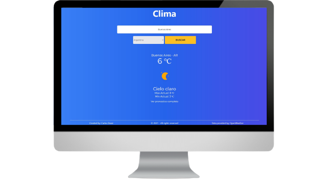

# Weather-Project

<p align="center" ><a href='https://clima-deasi.netlify.app/' target='_blank'></a></p>

<br>

<h2 align='center'> Search wheater - API OpenWeather</h2>

### Notas:

<br>

Reconstruir modulos de node
```
npm install
```

Genera archivo styles.css - TailwindCSS
```
build-css
```
Modo desarrollo
```
npm start
```
Construir el Build (Producción)
```
npm run build
```